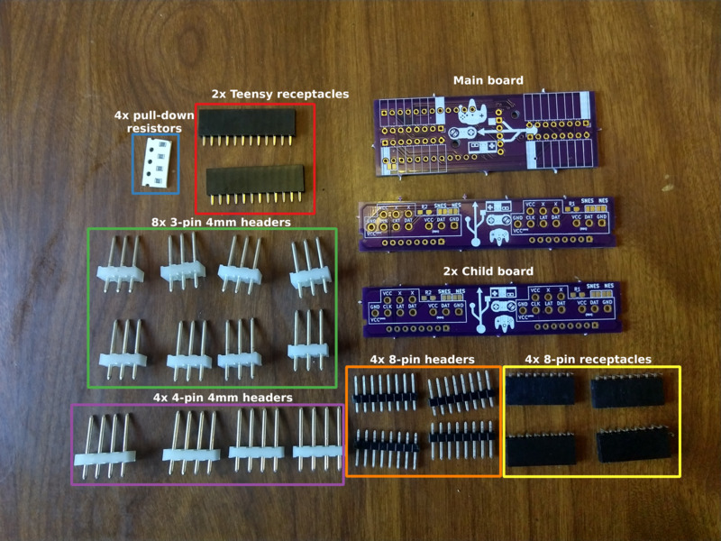

# Building Controller Pro v0.9

_This document last updated 2019-10-23_

## Supplies

For starters, here's what you should have:

* 1 Main board 
* 2 Child boards
* 4 8-pin headers
* 4 8-pin receptacles (right-angle)
* 2 Teensy receptacles (12-pin)
* 4 pull-down resistors (plus extras)
* 8 3-pin 4mm headers
* 4 4-pin 4mm headers

For those that want to just jump in, here's where they go:

