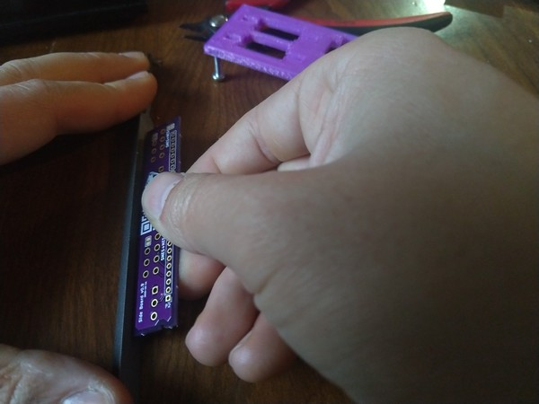
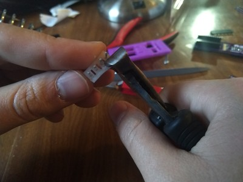
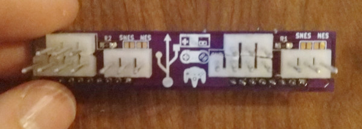
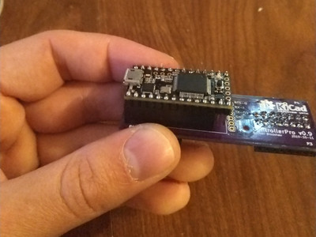

# Building Controller Pro v0.9

_This document last updated 2019-10-23_

## Supplies

For starters, here's what you should have:

- 1 Main board 
- 2 Child boards
- 4 8-pin headers
- 4 8-pin receptacles (right-angle)
- 2 Teensy receptacles (12-pin)
- 4 pull-down resistors (plus extras)
- 8 3-pin 4mm headers
- 4 4-pin 4mm headers

I use a 3D printed jig (`solder_helper()` in `controllers.scad`) to help hold things in place while soldering them. If you have access to a 3D printer, I recommend it, it should be a pretty quick print, although it may require a well-calibrated printer. It's designed to be able to pause the print and insert 3mm nuts to screw bolts into to hold it off the table:

For those that want to just jump in, here's where they go, and a quick summary of special notes:

Notes:

- The base of the 4mm headers is too wide to get the vertical pin spacing correct - you'll need to remove part of the base to get them close enough to each other.
- The 8-pin receptacles on one side sit on top of the protruding pins from the 12-pin teensy headers - I trim these pins back before I solder them, so the 8-pin headers can sit close to the board.
- SNES controllers will run into the three top pins on the child boards - if you don't want to have to squeeze (and scratch up) your SNES controller plugs, leave the top three pins off of one side board, and have an SNES side and an NES side.

## Soldering

### Main board (front)

First, put the Teensy receptacles (12-pin) in place, and trim the pins back so that the 8-pin headers will sit flat:

The pins should look like this, before/after:

Then go ahead and solder them in, just make sure to heat the short pins so there's still a good connection.

### Main board (back)

Next, flip the board over and add the four 8-pin receptacles. If using the jig, insert them into the slots as follows, put the board on, solder, and then pop the receptacles out. You may need to use a hand or clip to hold the board in place against the jig.

If not using a jig, it may be easier to solder them from the back, since these are right-angle headers:

Once the 8-pin headers are soldered in, the main board is done!

### Child board

If you're going to put it in a case, you'll need to sand down or otherwise remove the little protrusions around the edge of the side boards. I found a small triangle file did the trick quite well, but any file or even wire cutters will work fine. You can do this to the main board as well, but the clearances in the case for those don't require it.
 

It's easiest to solder the resistors before any headers are in place, so start with that. They go in the R1/R2 slots - there are a few solder bridges, they can be ignored, as they're for configurations we won't be using.

The order of the headers only really matters if you're using the jig, which was designed to solder the 8-pin headers first. So, do so, on the side with the outline for the headers and QR code. If using the jig, insert the headers in long-side down and place the board on top:

Next, add the 4mm headers. Your kit may already have the bases trimmed, if not, you'll need to remove part of the bases on four each of the 3- and 4-pin headers. I use small nippers from Ace Hardware, a rotary tool or any number of cutting tools would also do the trick. You just need to remove enough base that the remaining base extends no more than 2mm out from the pins so they will fit together.

If using nippers, I advise scoring both sides by squeezing the nippers partway down before attempting to clip all the way through, otherwise the header may break in half:

You should end up with all four 4-pin headers clipped, four 3-pin clipped, and four 3-pin unclipped:

Once clipped, you can put them in placed - again, if using the jig, place them long-end down. Otherwise, I advise using an alligator clip/helping hand/etc to hold the headers in place:

Solder in place, and you're good to go!

Rinse and repeat for the second board, except one caveat: SNES controllers will run into the top three pins if populated. You can kind of squeeze the SNES connector and it'll fit, but over time this leads to scratches on the connector, so you can also leave the top three pins off one side, and have one side be for NES and the other be for SNES. I'm still looking for a better way to avoid this problem (folding headers? collapsing headers?), but since most NES/SNES games only use two controllers anyway, having one side for each works well enough. This is what an SNES side board should look like:

N64 controllers work fine in either configuration, of course. And if you really want to, you can also order an extra set of side boards, since they are interchangeable, or just squeeze the SNES controllers in.

## Assembly

At this point you should have two side boards, a main board, and a Teensy:

First, put the Teensy on the main board. The last two pins will overhang the end, they are unused in this design:

Then, plug the sideboards into the main board using the 8-pin headers:

